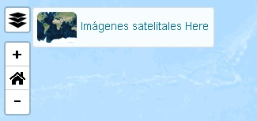
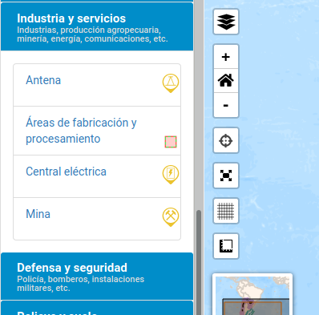
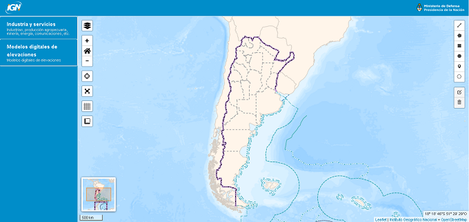
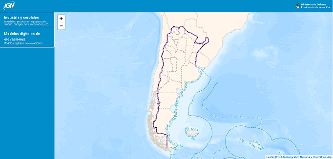

---

Argenmap es un visor de mapas desarrollado por el [Instituto Geográfico Nacional](https://www.ign.gob.ar) de licencia libre que permite mostrar mapas base, capas superpuestas desde servicios WMS y WMTS, consultar sus datos y agregar extensiones.

Está basado en [Leaflet](https://leafletjs.com/) y para funcionar sólo requiere ser publicado con un servidor web. A partir de un archivo de configuración en formato JSON genera un panel lateral con todas las capas publicadas. 

Las capas se agrupan en el panel en secciones que son definidas en el archivo de configuración.

Cuenta por defecto con el mapa base de la República Argentina y se pueden agregar otros.

## Requerimientos

- Servidor web (Nginx, Apache, lighttpd, etc.)

## Inicio rápido

### Primer paso: descarga

Clonar el repositorio o descargarlo en formato ZIP y descomprimirlo:

Para clonar, usar la URL https://github.com/ign-argentina/argenmap.git
y el comando:

    git clone https://github.com/ign-argentina/argenmap.git

Para descargar el repositorio comprimido en formato ZIP: 

https://github.com/ign-argentina/argenmap/archive/master.zip

### Segundo paso: agregar capas

Copiar el archivo `menu.json` del carpeta “examples” a la carpeta “js”.

> En este archivo se definen los mapas base y capas, al modificarlo y recargar la página se verán los cambios hechos.

En la sección **Personalización** se detallan los pasos para modificar el archivo de configuración.
### Tercer paso 

Publicar el contenido de este repositorio con un servidor web o con alguna herramienta de depuración como LiveServer en Visual Studio Code, SimpleHTTPServer en Python, etc.

## Personalización

   > Esta sección explica cómo se pueden modificar las capas, los mapas base, el aspecto visual y extensiones del mapa.

Los mapas base y capas se definen en el archivo `js/menu.json` y en el mismo se puede seleccionar un “template” (ver sección Template). 

### Mapas base

Se pueden agregar y modificar los mapas base, en el archivo `menu.json`, en el atributo "capas":

### Capas desde WMS y WMTS

Dentro del archivo `menu.json` se pueden agregar servicios WMS y WMTS.

Cada bloque dentro del JSON puede definir un servicio diferente y en el panel o menú lateral generará una sección colapsable que contiene las capas de ese servicio como se ve en la siguiente imagen.

El valor de la propiedad "type" para WMS debe ser "wsmlayer" y "wmts" para WMTS.

### Template

Es un conjunto de archivos que puede cambiarse para personalizar el aspecto visual y extensiones del mapa, por defecto se incluyen dos:

+ *`ign-geoportal-basic`*: 

    Contiene varias extensiones de Leaflet como dibujo, pantalla completa, mostrar ubicación, medición de distancias y áreas, mini mapa, posición del cursor (coordenadas), gratícula, WMS, WMTS y acercar a posición de inicio.

    

+ *`ign-geoportal-minimal`*:
    
    Sólo incluye el mapa sin extensiones.
    
    

> Para crear un template personalizado se puede hacer un fork del respositorio de otro existente como por ejemplo de [template IGN](https://github.com/ign-argentina/argenmap-leaflet-ign-tpl) o crear una copia de la carpeta del template tomado como base.

Cada template contiene:

+ `css`: reglas de estilos
+ `img`: logos, íconos de mapas base, símbolos de capas (dentro de img/legends)
+ `js`:
    + `mapa.js`: define títulos, logos, carga las extensiones (plugins)
    + extensiones (carpetas de cada extensión incluida por el template)
+ `main.html`: agrega mapa.js, reglas de estilos y otros recursos 