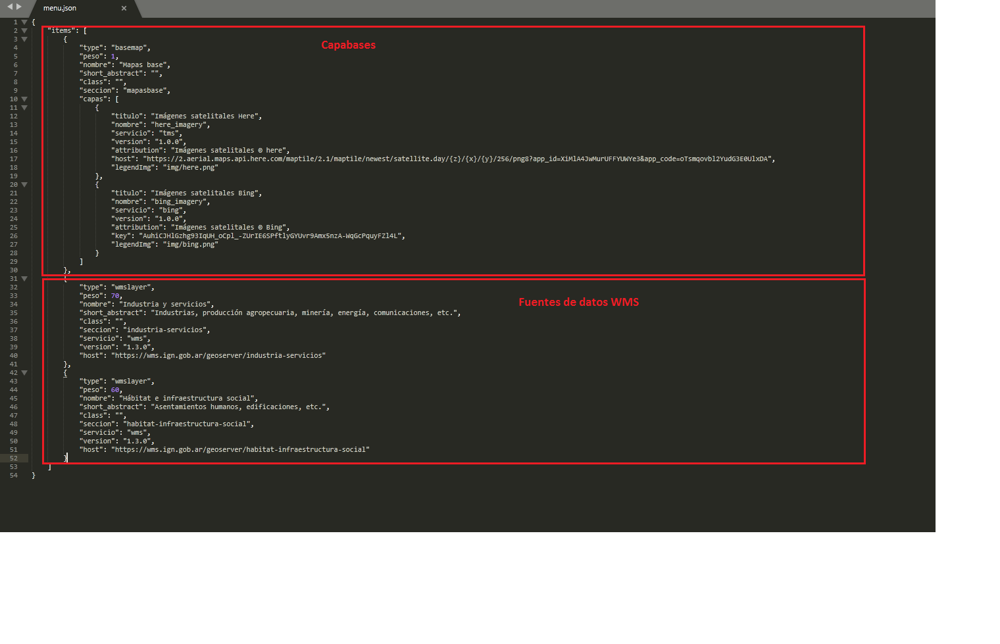

# argenmap
Visualizador de mapas. Consulta uno o varios Geoserver y genera un menú con todas las capas publicadas para consumirlas en un visualizador Leaflet.js

# Instalacíon
Clonar el repositorio, o descargarlo en formato ZIP y descomprimirlo

Ejecutar el script de setup

En linux:

```sh setup.sh```

En Windows:

```setup.bat```

Editar el archivo js/menu.json agregando o quitando la dirección donde consultar los capabilities de cada servidor Geoserver a visualizar.

En la primer sección del archivo menu.json se agregan todas las capabase que se necesiten

En la segunda sección se agrega la dirección de cada Geoserver que se necesite


