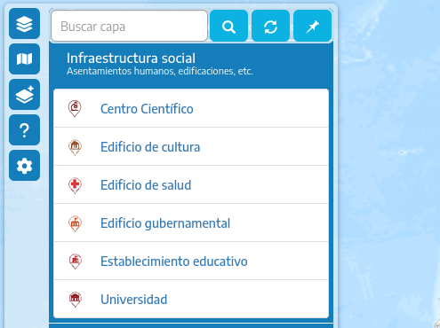

<!-- trunk-ignore-all(markdownlint/MD041) -->

Esta sección explica cómo se pueden configurar las capas, los mapas base, el aspecto visual, extensiones y vista del mapa y otras opciones.

> [!TIP]
> Para facilitar la creación de una nueva configuración, copiar los archivos de configuración por defecto que están en el directorio `src/config/default` al directorio `src/config` y editar los nuevos archivos JSON.

> [!CAUTION]
>
> 1. Si la sintaxis de los archivos JSON es incorrecta, la aplicación podría detener su ejecución o quedar cargada parcialmente. Validar la sintaxis de los archivos JSON con validadores web o los que incluyen editores de código fuente.
>
> 2. Si las secciones u orígenes de datos WMS / WMTS no tienen los atributos como se indican en este artículo podrían quedar sin cargar en el panel, o con un orden o datos incorrectos. Validar que los servicios a incluir se encuentren funcionando y su URL sea correctamente incluida
>
> 3. Validar que las URL de las imagenes de logos y otros recursos a referenciar en los archivos JSON sean correctas.

## Mapas base y capas

El archivo `data.json` se compone de bloques llamados **items**, el primero agrupa los mapas base y los siguientes las secciones desplegables que agrupan capas.

> [!NOTE]
> Llamamos bloque a lo que está entre dos llaves `{ }`

### Estructura del archivo data.json

_comentarios después de cada `"//"`_

<!-- </details>

<summary>### Estructura del archivo data.json</summary> -->

```jsonc
{
  "items": [
    {
      "capas": [
        {
          // Mapa base.
        },
        {
          // Otros mapas base.
        }
      ]
    },
    {
      // Fuente de capas desde WMS o WMTS.
    },
    {
      // Otra fuente de capas desde WMS o WMTS.
    }
  ],
  "layers_joins": [
    {
      // Fusión de dos capas en un sólo botón del menú (opcional).
    }
  ],
  "template": "", // Obsoleto. Puede ser necesario por compatibiliad.
  "template_feature_info_exception": [
    // Lista de nombres de atributos de las capas WMS que serán ignorados en las consultas.
  ]
}
```

<!-- </details> -->

### Definir un mapa base

> [!TIP]
> Si el mapa base es un servicio TMS se puede agregar un "-" al parámetro "y" quedando `{-y}` o invertir el orden de los demás parámetros para evitar que el mapa quede con las teselas desordenadas ya que TMS invierte el valor de `{y}` con respecto a los servicios XYZ.
>
> Consultar la documentación del servicio a agregar.

Tomando como referencia la estructura descrita en el apartado anterior, dentro del atributo "capas" del primer bloque, agregar uno nuevo bloque por cada mapa base como se muestra a continuación.

**Ejemplo de un bloque de mapa base:**

```jsonc
{
  "titulo": "Argenmap", // Nombre que aparece en el menú.
  "nombre": "argenmap", // Nombre interno, en minúsculas, sin espacios, tildes ni caracteres especiales.
  "servicio": "tms", // Tipo de servicio.
  "version": "1.0.0", // Versión del servicio.
  "attribution": "Instituto Geográfico Nacional + OpenStreetMap", // Texto de atribución que aparecerá en la parte inferior del visor al seleccionar este mapa base.
  "host": "https://wms.ign.gob.ar/geoserver/gwc/service/tms/1.0.0/capabaseargenmap@EPSG%3A3857@png/{z}/{x}/{-y}.png", // URL del mapa base.
  "legendImg": "src/styles/images/argenmap.png", // Imagen de previsualización que se muestra en el menú, preferentemente de 50 x 40 pixeles.
  "legend": "src/config/styles/images/legends/argenmap.jpg", // Imagen de referencias del mapa base
  "peso": 10, // orden vertical, mientras más grande sea más hacia abajo se ubicará dentro del menú, no debe repetir el valor con otros mapas.
  "selected": true, // Si se configura en 'true' es el mapa que aparece por defecto al abrir la aplicación.
  "zoom": {
    "min": 3, // Zoom mínimo disponible.
    "max": 19, // Zoom máximo disponible.
    "nativeMin": 3, // Zoom mínimo permitido por el visor para este mapa.
    "nativeMax": 21 // Zoom máximo permitido, estirando el mapa del zoom máximo hasta este nivel.
  }
}
```

### Definir servicios WMS o WMTS

Dentro de "items", después del primer bloque que define los mapas base se pueden definir servicios de capas, cada uno dentro de un bloque.

> [!NOTE]
> Cada bloque sirve para que la aplicación solicite al servicio WMS / WMTS el listado de las capas que publica, ese listado se conoce como _documento de capacidades_ o simplemente _capabilities_.
>
> Con esa información la aplicación genera en el panel o menú de capas una sección colapsable o "carpeta" que contiene las capas de ese servicio como se ve en la siguiente imagen.

**Ejemplo de carpeta "Infraestrucutra Social"**



**Ejemplo del bloque WMS**

```jsonc
{
  "tab": {
    // Indica la pestaña del menú en la que se incluye el servicio.
    "id": "IG", // Identificación de la pestaña.
    "searcheable": true, // 'true' permite encontrar las capas de la pestaña con el cuadro de búsqueda del menú.
    "content": "Info. Geoespacial" // Texto que aparece como título de la pestaña.
  },
  "type": "wms", // Tipo de servicio.
  "peso": 140, // Orden vertical, mientras más grande sea más hacia abajo se ubicará dentro del menú, no debe repetir el valor de otros bloques.
  "nombre": "Imágenes satelitales CONAE", // Título de la sección desplegable.
  "short_abstract": "", // Texto debajo del título.
  "class": "", // Obsoleto.
  "seccion": "conae", // Nombre interno, en minúsculas, sin espacios, tildes ni caracteres especiales.
  "servicio": "wms", // Servicio.
  "version": "1.3.0", // Versión del servicio.
  "host": "https://geotematico01.conae.gov.ar/geoserver/Localidades/wms", // URL del servicio, no hace falta agregar los parámetros como 'request', 'service' ni 'version'.
  "allowed_layers": [
    // Lista de las capas que se deben mostrar, las demás del servicio se ignoran. Deben incluirse los nombres de las capas como están en el doc. de capacidades del WMS.
    "Centro",
    "Cuyo",
    "NEA",
    "NOA",
    "PatagoniaNorte",
    "PatagoniaSur",
    "Centro_huellas_localidades",
    "Cuyo_huellas_localidades",
    "NEA_huellas_localidades",
    "NOA_huellas_localidades",
    "PatagoniaNorte_huellas_localidades",
    "PatagoniaSur_huellas_localidades"
  ],
  "icons": {
    // Íconos personalizados para las capas, se define como "nombre de capa", "URL del icono".
    "Centro": "src/config/default/styles/images/legends/satelite.svg",
    "Cuyo": "src/config/default/styles/images/legends/satelite.svg",
    "NEA": "src/config/default/styles/images/legends/satelite.svg",
    "NOA": "src/config/default/styles/images/legends/satelite.svg",
    "PatagoniaNorte": "src/config/default/styles/images/legends/satelite.svg",
    "PatagoniaSur": "src/config/default/styles/images/legends/satelite.svg"
  }
}
```

**Resultado del bloque anterior**


**Ejemplo del bloque WMTS**

```jsonc
{
  "tab": {
    "id": "IG",
    "searcheable": true,
    "content": "Info. Geoespacial"
  },
  "type": "wmts", // Tipo de servicio
  "peso": 100,
  "nombre": "Cartografía", // Título de la sección desplegable
  "short_abstract": "Cartas topográficas, atlas topográficos, cartografía, etc.", // Texto debajo del título
  "class": "",
  "seccion": "cartografia",
  "servicio": "wmts", 
  "version": "1.0.0", // Versión del servicio
  "host": "https://imagenes.ign.gob.ar/geoserver/cartas_mosaicos" // URL del servicio
}
```

### Unificar 2 capas en un botón

Pueden fusionarse dos capas en un mismo botón, por ejemplo para poder superponer una capa vectorial desde un WMS sobre una capa de imágenes WMTS. 

Dentro del bloque "layers_joins", agregar un bloque para unir dos capas.

**Ejemplo de bloque de unión de 2 capas**

```jsonc
{
  "seccion": "conae", // Sección desplegable en donde se incluye este botón.
  "host": "https://geotematico01.conae.gov.ar/geoserver/Localidades/wms", // URL del servicio de la capa que queda de fondo
  "layer": "PatagoniaSur", // Nombre de la capa que queda de fondo.
  "joins": [
    {
      "seccion": "conae", // Sección desplegable en donde se incluye este botón.
      "host": "https://geotematico01.conae.gov.ar/geoserver/Localidades/wms", // URL del servicio de la capa que se superpone a la de fondo
      "layer": "PatagoniaSur_huellas_localidades" // Nombre de la capa que se superpone.
    }
  ]
}
```

**El último botón de la siguiente imagen es resultado del bloque anterior**


## Parámetros del visor

El archivo `preferences.json` es utilizado para configurar varios aspectos de la aplicaciónse como pueden ser definir opciones de inicio como la posición y zoom del mapa, estilos, entre otros.

**Ejemplo con comentarios**

```jsonc
{
  "analytics_ids": ["X-XXXXXXXXXX"], // Contiene identificadores de seguimiento para herramientas de analíticas como Google Analytics. Dejar "" si no corresponde.
  "charts": {
    "isActive": true // Habilita o deshabilita las funcionalidades de gráficos.
  },
  "excluded_plugins": [
    "minimap" // Extensión (herramienta) a excluir.
  ],
  "favicon": "src/config/styles/images/favicon.ico", // Icono para la pestaña del navegador.
  "geocoder": {
    // Configura el servicio de geocodificación. No modificar.
    "key": "", // Clave de acceso al servicio.
    "lang": "es", // Idioma de los resultados.
    "limit": 5, // Límite de resultados.
    "query": "q", // Parámetro de búsqueda.
    "search": "search", // Parámetro de búsqueda.
    "url": "https://api.ign.gob.ar/buscador/", // URL del servicio.
    "url_by_id": "places"
  },
  "geoprocessing": {
    "availableProcesses": [
      // Configura las tareas de geoprocesamiento disponibles.
      {
        "baseUrl": "https://imagenes.ign.gob.ar/geoserver/geoprocesos/ows?service=WPS&version=1.0.0",
        "geoprocess": "contour",
        "layer": "alos_unificado",
        "name": "Curvas de Nivel",
        "namePrefix": "curvas_de_nivel_",
        "styles": {
          "d_line_color": "#967529", // Color de curva de nivel directriz.
          "d_line_m": 500, // Equidistancia entre directrices.
          "d_weigth": 1, // Ancho directrices.
          "line_color": "#e0b44c", // Color de las curvas.
          "line_weight": 0.8, // Ancho de las curvas.
          "smoothFactor": 1.7 // Factor de suavizado.
        }
      },
      {
        "baseUrl": "https://imagenes.ign.gob.ar/geoserver/ows?service=WPS&version=1.0.0",
        "geoprocess": "waterRise",
        "layer": "geoprocesos:alos_unificado",
        "name": "Cota",
        "namePrefix": "cota_"
      },
      {
        "geoprocess": "buffer",
        "name": "Área de influencia",
        "namePrefix": "area_de_influencia_"
      },
      {
        "geoprocess": "elevationProfile",
        "name": "Perfil de Elevación",
        "namePrefix": "profile_"
      }
    ],
    "buttonIcon": "fa fa-cog",
    "buttonTitle": "Geoprocesos",
    "dialogTitle": "Geoprocesos",
    "isActive": true, // Habilita o deshabilita las funcionalidades de geoprocesamiento.
    "strings": {
      "bounds": "Areas a procesar"
    }
  },
  "hillshade": {
    // Agrega una capa de sombreado de montañas al mapa.
    "addTo": [
      // Lista de mapas base definidos en data.json que incluyen botón para superponer sombras.
      "argenmap",
      "argenmap_gris"
    ],
    "attribution": "sombra de montaña ©Esri", // Atribución de la capa.
    "icon": "src/styles/images/mountains.svg", // Icono del botón.
    "name": "hillshade",
    "switchLabel": "Agregar sombra de montaña Esri", // Texto del botón.
    "url": "https://services.arcgisonline.com/arcgis/rest/services/Elevation/World_Hillshade/MapServer/tile/{z}/{y}/{x}.png" // URL del servicio. No modificar.
  },
  "logo": {
    // Configura el logo de la aplicación.
    "height": "47px", // Atura en pixeles.
    "width": "365px", // Ancho en pixeles.
    "miniWidth": "", // Ancho mínimo.
    "miniHeight": "", // Altura mínima.
    "style": "filter: drop-shadow(1px 1px 1px #103847)", // Propiedades CSS adicionales del logo.
    "src": "src/config/styles/images/logo2.png", // Dirección de la imagen del logo.
    "srcLogoMini": "src/config/styles/images/logo_RESPONSIVE.png", // Dirección de la imagen del logo. para móviles
    "ministyle": "filter: drop-shadow(1px 1px 1px #103847);", // Propiedades CSS para relación de aspecto portrait o móvil.
    "title": "Instituto Geográfico Nacional", // Texto que aparece al pasar el cursor encima.
    "link": "https://www.ign.gob.ar/" // URL a la que redirige el logo al hacer clic.
  },
  "metaTags": {
    // Configura las etiquetas meta de la aplicación.
    "description": "Visor de mapas desarrollado por el Instituto Geográfico Nacional", // Descripción de la aplicación.
    "image": "/src/styles/images/argenmap.png", // URL de la imagen que se muestra al compartir la aplicación en redes sociales.
    "title": "IGN - Argenmap" // Título de la aplicación.
  },
  "mapConfig": {
    // Establece la vista inicial y los niveles de zoom del mapa (si la URL no incluye parámetros).
    "center": {
      // Coordenadas del centro del mapa.
      "latitude": -40,
      "longitude": -59
    },
    "zoom": {
      "initial": 4, // Zoom al cargar el mapa.
      "min": 3, // Zoom mínimo permitido.
      "max": 21 // Zoom máximo permitido.
    }
  },
  "onInit": {
    // Configura las acciones que se ejecutan al cargar la aplicación.
    "showToolbar": true, // Muestra o no la barra de herramientas.
    "showLayerMenu": true // Muestra o no el menú de capas.
  },
  "searchbar": {
    // Configura el cuadro de búsqueda de localidades.
    "background_color": "rgba(255, 255, 255, 0.7)", // Color de fondo.
    "color_focus": "#008dc9", // Color del texto al enfocar.
    "isActive": true, // Habilita o deshabilita el cuadro de búsqueda.
    "left": "40%", // Desplazamiento desde el borde izquierdo.
    "strings": {
      "placeholder": "Buscar localidad..." // Texto de ayuda.
    },
    "top": "5px" // Desplazamiento desde el borde superior.
  },
  "showSearchBar": true, // Muestra o no el cuadro de búsqueda del menu de capas.
  "strings": {
    // Textos de la aplicación.
    "basemap_legend_button_text": "Ver leyenda del mapa", // Texto del botón de leyenda del mapa base.
    "basemap_max_zoom": " y máximo de ",
    "basemap_min_zoom": "Zoom mínimo de ",
    "delete_geometry": "Eliminar geometría" // Texto del botón para eliminar geometría del menu contextual.
  },
  "table": {
    "isActive": false, // Habilita o deshabilita la vista de los datos en formato tabla al consultar una capa WMS en lugar del popup (vista por defecto).
    "rowsLimit": 5 // Límite de filas a mostrar en la tabla.
  },
  "theme": {
    // Configura los colores de la aplicación.
    "activeLayer": "#33b560", // Color de la capa activa.
    "bodyBackground": "#0094d4", // Color de fondo.
    "headerBackground": "#157DB9", // Color de fondo del encabezado.
    "iconBar": "#4f4f4f", // Color de los iconos de la barra de herramientas.
    "menuBackground": "#157DB9", // Color de fondo del menú.
    "btnColor": "#fff", // Color de los botones.
    "textLegendMenu": "#fff", // Color del texto del menú de leyendas.
    "textLegendMenuStyle": "",
    "textMenu": "#fff", // Color del texto del menú.
    "textMenuStyle": "" // Estilo del texto del menú.
  },
  "title": "IGN - Argenmap", // Título de la aplicación.
  "website": "https://www.ign.gob.ar/", // URL de la aplicación.
  "mainPopup": {
    // Configura el popup principal mostrado al cargar la aplicación.
    "isActive": false, // Habilita o deshabilita el popup. Deshabilitado por defecto.
    "welcomeSign": "",
    "image": "https://static.ign.gob.ar/img/logo.png", // URL de la imagen.
    "text": "¡Hola mundo! ¡Bienvenido a nuestro visor!" // Texto del popup.
  }
}
```

## Personalizar más la apariencia

Para modificar más el aspecto visual de la aplicación puede agregarse en `src/config/styles` los siguientes directorios y archivos:

> [!TIP]
> se pueden copiar desde `src/config/default/styles`

- `src/config/styles/css/main.css` : reglas de estilos CSS (el original está en `src/styles/css`)
- `src/config/styles/images` : logos y otras imágenes. Se pueden referenciar en los archivos JSON.
- `src/config/styles/images/legends` : la aplicación busca por defecto en esta ubicación imágenes con el mismo nombre que las capas y las agrega al panel usándolas como leyenda o previsualización
