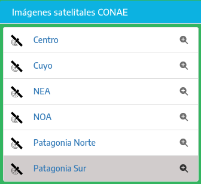

<!-- trunk-ignore-all(markdownlint/MD041) -->

Esta sección explica cómo se pueden configurar las capas, los mapas base, el aspecto visual, extensiones y vista del mapa y otras opciones.

> [!TIP]
> Para facilitar la creación de una nueva configuración, copiar los archivos de configuración por defecto que están en el directorio `src/config/default` al directorio `src/config` y editar los nuevos archivos JSON.

> [!CAUTION]
> 1. Si la sintaxis de los archivos JSON es incorrecta, la aplicación podría detener su ejecución o quedar cargada parcialmente. Validar la sintaxis de los archivos JSON con validadores web o los que incluyen editores de código fuente.
> 
> 2. Si las secciones u orígenes de datos WMS / WMTS no tienen los atributos como se indican en este artículo podrían quedar sin cargar en el panel, o con un orden o datos incorrectos. Validar que los servicios a incluir se encuentren funcionando y su URL sea correctamente incluida
>
> 3. Validar que las URL de las imagenes de logos y otros recursos a referenciar en los archivos JSON sean correctas.


## Mapas base y capas
---

El archivo `data.json` se compone de bloques llamados **items**, el primero agrupa los mapas base y los siguientes las secciones desplegables que agrupan capas.

> [!NOTE]
> Llamamos bloque a lo que está entre dos llaves `{ }` 

### Estructura del archivo data.json 

*comentarios después de cada "//"*
<!-- </details>

<summary>### Estructura del archivo data.json</summary> -->

```jsonc
{
  "items": [
    {
      "capas": [
         {
            // mapa base
         },
         {
            // otro mapa base
         }
      ]
    },
    {
      // fuente de capas desde WMS o WMTS
    },
    {
      // otra fuente de capas desde WMS o WMTS
    }
  ],
  "layers_joins": [
    {
      // (opcional) agrupamiento de dos capas en un sólo botón del menú
    }
  ],
  "template": "", // (obsoleto, puede ser necesario por compatibiliad)
  "template_feature_info_exception": [
      // lista de nombres de atributos de las capas WMS que serán ignorados en las consultas
  ]
}
```

<!-- </details> -->

### Definir un mapa base

Tomando como referencia la estructura anterior, dentro del atributo "capas" del primer bloque, agregar uno nuevo por cada mapa base. 

> [!TIP]
> Si el mapa base es un servicio TMS, el mapa podría quedar con las teselas desordenadas. Para resolverlo se puede agregar un "-" al parámetro y o cambiar el orden de los demás parámetros. 
> 
> Consultar la documentación del servicio a agregar.

**Ejemplo de un bloque de mapa base:**

```jsonc
{
   "titulo": "Argenmap", // nombre que aparecerá en el menú
   "nombre": "argenmap", // nombre interno, en minúsculas, sin espacios, tildes ni caracteres especiales
   "servicio": "tms", // tipo de servicio
   "version": "1.0.0", // versión del servicio
   "attribution": "Instituto Geográfico Nacional + OpenStreetMap", // texto de atribución que aparecerá en la parte inferior del visor al seleccionar este mapa base 
   "host": "https://wms.ign.gob.ar/geoserver/gwc/service/tms/1.0.0/capabaseargenmap@EPSG%3A3857@png/{z}/{x}/{-y}.png", // URL del mapa base
   "legendImg": "src/styles/images/argenmap.png", // imagen de previsualización que se muestra en el menú, preferentemente de 50 x 40 pixeles 
   "legend": "src/config/styles/images/legends/argenmap.jpg", // imagen de referencias del mapa base
   "peso": 10, // orden vertical, mientras más grande sea más hacia abajo se ubicará dentro del menú, no debe repetir el valor con otros mapas
   "selected": true, // si está en 'true' es el mapa que aparece por defecto al abrir la aplicación
   "zoom": {
      "min": 3, // zoom mínimo disponible
      "max": 19, // zoom máximo disponible
      "nativeMin": 3, // zoom mínimo permitido por el visor para este mapa
      "nativeMax": 21 // zoom máximo permitido, estirando el mapa del zoom máximo hasta este nivel
   }
}
```

### Definir servicios WMS o WMTS (fuentes de capas)

Dentro de "items", después del primer bloque que define los mapas base se pueden definir servicios de capas, cada uno dentro de un bloque.

> [!NOTE]
> Cada bloque sirve para que la aplicación solicite el documento de capacidades al servicio WMS / WMTS, ese archivo contiene un listado de las capas que publica. Con esa información la aplicación genera de forma automática en el panel de capas o menú lateral una sección colapsable que contiene las capas de ese servicio como se ve en la siguiente imagen.


**Ejemplo del bloque WMS**

```jsonc
{
   "tab": { // indica la pestaña del menú en la que se incluye el servicio
      "id": "IG", // identificación de la pestaña
      "searcheable": true, // 'true' permite encontrar las capas de la pestaña con el cuadro de búsqueda del menú
      "content": "Info. Geoespacial" // texto que aparece como título de la pestaña
   },
   "type": "wms", // tipo de servicio
   "peso": 140, // orden vertical, mientras más grande sea más hacia abajo se ubicará dentro del menú, no debe repetir el valor de otros bloques
   "nombre": "Imágenes satelitales CONAE", // título de la sección desplegable
   "short_abstract": "", // texto debajo del título
   "class": "", // obsoleto
   "seccion": "conae", // nombre interno, en minúsculas, sin espacios, tildes ni caracteres especiales
   "servicio": "wms", // servicio
   "version": "1.3.0", // versión del servicio
   "host": "https://geotematico01.conae.gov.ar/geoserver/Localidades/wms", // URL del servicio, no hace falta agregar los parámetros como 'request', 'service' ni 'version'
   "allowed_layers": [ // lista de las capas que se deben mostrar, las demás del servicio se ignoran. Deben incluirse los nombres de las capas como están en el doc. de capacidades del WMS
      "Centro",
      "Cuyo",
      "NEA",
      "NOA",
      "PatagoniaNorte",
      "PatagoniaSur",
      "Centro_huellas_localidades",
      "Cuyo_huellas_localidades",
      "NEA_huellas_localidades",
      "NOA_huellas_localidades",
      "PatagoniaNorte_huellas_localidades",
      "PatagoniaSur_huellas_localidades"
   ],
   "icons": { // iconos personalizados para las capas, se define como "nombre de capa", "URL del icono"
      "Centro": "src/config/default/styles/images/legends/satelite.svg",
      "Cuyo": "src/config/default/styles/images/legends/satelite.svg",
      "NEA": "src/config/default/styles/images/legends/satelite.svg",
      "NOA": "src/config/default/styles/images/legends/satelite.svg",
      "PatagoniaNorte": "src/config/default/styles/images/legends/satelite.svg",
      "PatagoniaSur": "src/config/default/styles/images/legends/satelite.svg"
   }
}
```

**Resultado del bloque anterior**



**Ejemplo del bloque WMTS**

```jsonc
{
   "tab": {
      "id": "IG",
      "searcheable": true,
      "content": "Info. Geoespacial"
   },
   "type": "wmts",
   "peso": 100,
   "nombre": "Cartografía",
   "short_abstract": "Cartas topográficas, atlas topográficos, cartografía, etc.",
   "class": "",
   "seccion": "cartografia",
   "servicio": "wmts",
   "version": "1.0.0",
   "host": "https://imagenes.ign.gob.ar/geoserver/cartas_mosaicos"
}
```

### Unificar 2 capas en un botón

Pueden unirse dos capas en un mismo botón, por ejemplo para poder superponer una capa vectorial desde un WMS sobre una capa de imágenes WMTS.

Dentro del bloque "layers_joins", agregar un bloque para unir dos capas.

**Ejemplo de bloque de unión de 2 capas**

```jsonc
{
  "seccion": "conae", // sección desplegable en donde se incluye este botón
  "host": "https://geotematico01.conae.gov.ar/geoserver/Localidades/wms", // URL del servicio de la capa que queda de fondo
  "layer": "PatagoniaSur", // nombre de la capa de fondo
  "joins": [
    {
      "seccion": "conae", // sección desplegable en donde se incluye este botón
      "host": "https://geotematico01.conae.gov.ar/geoserver/Localidades/wms", // URL del servicio de la capa que se superpone a la de fondo
      "layer": "PatagoniaSur_huellas_localidades" // capa superpuesta
    }
  ]
}
```

**El último botón de la siguiente imagen es resultado del bloque anterior**


## Parámetros del visor

En el archivo `preferences.json` se pueden definir opciones de inicio de la aplicación como la posición y zoom del mapa entre otros.

**Ejemplo con comentarios**

```jsonc
{
  "analytics_ids": ["X-XXXXXXXXXX"], // identificador de Google Analytics (dejar "" si no corresponde)
  "charts": {
    "isActive": true // 'true' si la consulta de capas incluye la vista de gráficos
  },
  "excluded_plugins": [
    "minimap" // extensión (herramienta) a excluir
  ],
  "favicon": "src/config/styles/images/favicon.ico", // icono para la pestaña del navegador
  "geocoder": { // configuración del geocodificador, no modificar
    "key": "",
    "lang": "es",
    "limit": 5,
    "query": "q",
    "search": "search",
    "url": "https://api.ign.gob.ar/buscador/",
    "url_by_id": "places"
  },
  "geoprocessing": {
    "availableProcesses": [ // geoprocesos disponibles
      {
        "baseUrl": "https://imagenes.ign.gob.ar/geoserver/geoprocesos/ows?service=WPS&version=1.0.0",
        "geoprocess": "contour",
        "layer": "alos_unificado",
        "name": "Curvas de Nivel",
        "namePrefix": "curvas_de_nivel_",
        "styles": {
          "d_line_color": "#967529", // color de curva de nivel directriz
          "d_line_m": 500, // equidistancia entre directrices
          "d_weigth": 1, // ancho directrices
          "line_color": "#e0b44c", // color de curvas
          "line_weight": 0.8, // ancho de curvas
          "smoothFactor": 1.7 // factor de suavizado
        }
      },
      {
        "baseUrl": "https://imagenes.ign.gob.ar/geoserver/ows?service=WPS&version=1.0.0",
        "geoprocess": "waterRise",
        "layer": "geoprocesos:alos_unificado",
        "name": "Cota",
        "namePrefix": "cota_"
      },
      {
        "geoprocess": "buffer",
        "name": "Área de influencia",
        "namePrefix": "area_de_influencia_"
      },
      {
        "geoprocess": "elevationProfile",
        "name": "Perfil de Elevación",
        "namePrefix": "profile_"
      }
    ],
    "buttonIcon": "fa fa-cog",
    "buttonTitle": "Geoprocesos",
    "dialogTitle": "Geoprocesos",
    "isActive": true, // 'false' deshabilita los geoprocesos
    "strings": {
      "bounds": "Areas a procesar"
    }
  },
  "hillshade": { // sombras de montañas
    "addTo": [ // lista de mapas base definidos en data.json que incluyen botón para superponer sombras
      "argenmap",
      "argenmap_gris"
    ],
    "attribution": "sombra de montaña ©Esri", // texto de atribución que aparece al activar
    "icon": "src/styles/images/mountains.svg", // icono para el botón de sombras
    "name": "hillshade",
    "switchLabel": "Agregar sombra de montaña Esri",
    "url": "https://services.arcgisonline.com/arcgis/rest/services/Elevation/World_Hillshade/MapServer/tile/{z}/{y}/{x}.png" // URL del servicio, no modificar
  },
  "logo": { // configuración de imagen de identidad o logo
    "height": "47px", // alto en pixeles
    "width": "365px",
    "miniWidth": "", // ancho mínimo
    "miniHeight": "", // altura mínima
    "style": "filter: drop-shadow(1px 1px 1px #103847)", // propiedades CSS del logo
    "src": "src/config/styles/images/logo2.png", // URL del logo
    "srcLogoMini": "src/config/styles/images/logo_RESPONSIVE.png", // URL del logo para móviles
    "ministyle": "filter: drop-shadow(1px 1px 1px #103847);", // propiedades CSS para relación de aspecto portrait o móvil
    "title": "Instituto Geográfico Nacional", // texto que aparece al pasar el cursor encima
    "link": "https://www.ign.gob.ar/" // enlace para abrir al hacer click en el logo
  },
  "mapConfig": { // vista inicial del mapa (si la URL no incluye parámetros)
    "center": { // coordenadas del centro del mapa
      "latitude": -40,
      "longitude": -59
    },
    "zoom": {
      "initial": 4, // zoom al cargar
      "min": 3,
      "max": 21
    }
  },
  "searchbar": { // cuadro de búsqueda del geocodificador
    "background_color": "rgba(255, 255, 255, 0.7)", // color de fondo
    "color_focus": "#008dc9", // color al hacer click o escribir
    "isActive": true, // 'true' para habilitar el buscador
    "left": "40%", // desplazamiento desde el borde izquierdo
    "strings": {
      "placeholder": "Buscar localidad..." // texto que aparece antes de escribir
    },
    "top": "5px" // desplazamiento desde el borde superior
  },
  "showSearchBar": true, // 'true' incluye el cuadro de búsqueda de capas
  "strings": { // textos personalizados de la interfaz
    "basemap_legend_button_text": "Ver leyenda del mapa", // texto que se muestra al pasar el cursor sobre el botón leyenda de mapa base
    "basemap_max_zoom": " y máximo de ",
    "basemap_min_zoom": "Zoom mínimo de ",
    "delete_geometry": "Eliminar geometría" // texto de opción del menú contextual (click derecho)
  },
  "table": {
    "isActive": false, // 'true' habilita la vista de tabla al consultar una capa WMS en lugar del popup (vista por defecto)
    "rowsLimit": 5
  },
  "theme": { // estilo general
    "activeLayer": "#33b560", // color de botón de capa activa
    "bodyBackground": "#0cb2e1", // color de fondo
    "headerBackground": "#0cb2e1", // color de encabezado
    "iconBar": "#4f4f4f", // color de barra de iconos
    "menuBackground": "#0cb2e1", // color de fondo del menú de capas
    "textMenu": "white" // texto del menú de capas
  },
  "title": "IGN - Argenmap", // texto en pestaña del navegador
  "website": "https://www.ign.gob.ar/", // URL del visor
  "mainPopup": { // "ventana" o "popup" que se muestra delante del visor apenas carga
    "isActive": false, // deshabilitado por defecto
    "welcomeSign": "",
    "image": "https://static.ign.gob.ar/img/logo.png", // imagen a incluir
    "text": "¡Hola mundo! ¡Bienvenido a nuestro visor!" // texto del popup
  }
}
```

## Personalizar más la apariencia

Para modificar más el aspecto visual de la aplicación puede agregarse en `src/config/styles` los siguientes directorios y archivos:

> [!TIP]
> se pueden copiar desde `src/config/default/styles`

- `src/config/styles/css/main.css` : reglas de estilos CSS (el original está en `src/styles/css`)
- `src/config/styles/images` : logos y otras imágenes
- `src/config/styles/images/legends` : la aplicación busca por defecto en esta ubicación imágenes con el mismo nombre que las capas y las agrega al panel usándolas como leyenda o previsualización

