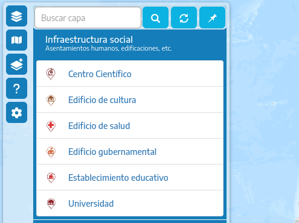
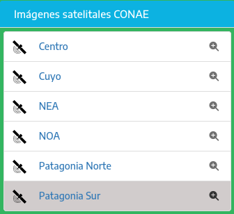

<!-- trunk-ignore-all(markdownlint/MD041) -->

# Guía de configuración de Argenmap

Esta guía explica cómo personalizar el visor Argenmap editando los archivos `preferences.json` y `data.json` para configurar las capas, los mapas base, el aspecto visual, extensiones y vista del mapa y otras opciones. Incluye ejemplos reales y recomendaciones para cada sección.

> 🛠️ **Destinado a**: Desarrolladores y administradores con conocimientos básicos de JSON.
> 💡 **Recomendación**: Usa un editor con soporte de JSON (vscode, webstorm) y validadores de sintaxis.

> [!TIP]
> Para facilitar la configuración, se recomienda utilizar un editor de texto con soporte para JSON y validación de sintaxis.

> [!CAUTION]
>
> ### ⚠️ Advertencias importantes
>
> 1. Si la sintaxis de los archivos JSON es incorrecta, la aplicación podría detener su ejecución o quedar cargada parcialmente. Validar la sintaxis de los archivos JSON con validadores web o los que incluyen editores de código fuente.
>
> 2. Si las secciones u orígenes de datos WMS / WMTS no tienen los atributos como se indican en este artículo podrían quedar sin cargar en el panel, o con un orden o datos incorrectos. Validar que los servicios a incluir se encuentren funcionando y su URL sea correctamente incluida
>
> 3. Validar que las URL de las imagenes de logos y otros recursos a referenciar en los archivos JSON sean correctas.

---

## 1. Ubicación de los archivos de configuración

Los archivos principales de configuración se encuentran en:

```text
src/config/preferences.json    → Configuración general, apariencia, plugins.
src/config/data.json           → Mapas base, capas, agrupaciones.
```

> [!TIP]
> Se recomienda copiar los archivos desde `src/config/default/` si es la primera vez que configuras el visor.

---

## 2. Configuración de mapas base y capas (`data.json`)

### Estructura básica

El archivo `data.json` se compone de bloques llamados **items**, el primero agrupa los mapas base y los siguientes las secciones desplegables que agrupan capas.

> [!NOTE]
> Llamamos bloque a lo que está entre dos llaves `{ }`

```jsonc
{
  "items": [
    {
      "capas": [
        {
          // Mapa base.
        },
        {
          // Otros mapas base.
        }
      ]
    },
    {
      // Fuente de capas desde WMS o WMTS.
    },
    {
      // Otra fuente de capas desde WMS o WMTS.
    }
  ],
  "layers_joins": [
    {
      // Fusión de dos capas en un sólo botón del menú (opcional).
    }
  ],
  "template": "", // Obsoleto. Puede ser necesario por compatibiliad.
  "template_feature_info_exception": [
    // Lista de nombres de atributos de las capas WMS que serán ignorados en las consultas.
  ]
}
```

También se admite una estructura separada con `sections` y `layers`. Es la
opción recomendada cuando varias capas comparten encabezado, pestaña o estilo:

```jsonc
{
  "items": [
    {
      "capas": [/* mapas base */]
    }
  ],
  "sections": [
    {
      "id": "eventos",
      "nombre": "Eventos",
      "tab": {
        "id": "IG",
        "searcheable": true,
        "content": "Info. Geoespacial"
      },
      "short_abstract": "Capas relacionadas con eventos"
    }
  ],
  "layers": [
    {
      "type": "file",
      "section": "eventos",
      "titulo": "Sedes",
      "source": {
        "url": "datos/sedes.geojson",
        "format": "geojson"
      }
    }
  ]
}
```

Cada capa debe indicar en `section` el `id` de una sección existente. Durante
la carga, la aplicación combina los datos de la sección con los de la capa. La
definición de la capa tiene prioridad cuando un atributo aparece en ambos
bloques. Los mapas base permanecen dentro de `items`.

#### Estilos de una sección

Una entrada de `sections` puede definir `section_style` para personalizar sólo
esa sección y sus capas:

```jsonc
{
  "id": "eventos",
  "nombre": "Eventos",
  "section_style": {
    "container": {
      "backgroundColor": "#ffffff",
      "backgroundImage": "linear-gradient(90deg, #75aadb, #ffffff)",
      "padding": "5px",
      "border": "1px solid #75aadb",
      "borderRadius": "12px"
    },
    "header": {
      "backgroundColor": "#202c5c",
      "backgroundImage": "src/styles/images/banner.webp",
      "backgroundGradient": "linear-gradient(90deg, rgba(0,0,0,.75), rgba(0,0,0,.25))",
      "backgroundSize": "cover",
      "backgroundPosition": "center",
      "backgroundRepeat": "no-repeat",
      "color": "#ffffff",
      "fontFamily": "Encode Sans, sans-serif",
      "fontSize": "20px",
      "fontWeight": "600",
      "fontStyle": "normal",
      "textTransform": "none",
      "letterSpacing": "0",
      "lineHeight": "1.2",
      "textDecoration": "none",
      "borderRadius": "9px",
      "icon": {
        "type": "image",
        "src": "src/styles/images/evento.png",
        "alt": "Eventos",
        "size": "24px"
      }
    },
    "layers": {
      "backgroundColor": "#ffffff",
      "color": "#303030",
      "fontFamily": "Encode Sans, sans-serif",
      "fontSize": "15px",
      "fontWeight": "400",
      "fontStyle": "normal",
      "textTransform": "none",
      "letterSpacing": "0",
      "lineHeight": "1.3",
      "textDecoration": "none"
    }
  }
}
```

El icono del encabezado también puede ser de Font Awesome, por ejemplo
`{"type":"font-awesome","class":"fas fa-futbol"}`. En pantallas móviles la
aplicación reduce los tamaños configurados cuando es necesario para mantener el
menú legible y los controles táctiles accesibles.

### Definir un mapa base

> [!TIP]
> Si el mapa base es un servicio TMS se puede agregar un "-" al parámetro "y" quedando `{-y}` o invertir el orden de los demás parámetros para evitar que el mapa quede con las teselas desordenadas ya que TMS invierte el valor de `{y}` con respecto a los servicios XYZ.
>
> Consultar la documentación del servicio a agregar.

Tomando como referencia la estructura descrita en el apartado anterior, dentro del atributo "capas" del primer bloque, agregar uno nuevo bloque por cada mapa base como se muestra a continuación.

### Ejemplo de mapas base

```jsonc
{
  "titulo": "Argenmap", // Nombre que aparece en el menú.
  "nombre": "argenmap", // Nombre interno, en minúsculas, sin espacios, tildes ni caracteres especiales.
  "servicio": "tms", // Tipo de servicio.
  "version": "1.0.0", // Versión del servicio.
  "attribution": "Instituto Geográfico Nacional + OpenStreetMap", // Texto de atribución que aparecerá en la parte inferior del visor al seleccionar este mapa base.
  "host": "https://wms.ign.gob.ar/geoserver/gwc/service/tms/1.0.0/capabaseargenmap@EPSG%3A3857@png/{z}/{x}/{-y}.png", // URL del mapa base.
  "legendImg": "src/styles/images/argenmap.png", // Imagen de previsualización que se muestra en el menú, preferentemente de 50 x 40 pixeles.
  "legend": "src/config/styles/images/legends/argenmap.jpg", // Imagen de referencias del mapa base
  "peso": 10, // orden vertical, mientras más grande sea más hacia abajo se ubicará dentro del menú, no debe repetir el valor con otros mapas.
  "selected": true, // Si se configura en 'true' es el mapa que aparece por defecto al abrir la aplicación.
  "zoom": {
    "min": 3, // Zoom mínimo disponible.
    "max": 19, // Zoom máximo disponible.
    "nativeMin": 3, // Zoom mínimo permitido por el visor para este mapa.
    "nativeMax": 21 // Zoom máximo permitido, estirando el mapa del zoom máximo hasta este nivel.
  }
}
```

### Definir servicios WMS o WMTS

Dentro de "items", después del primer bloque que define los mapas base se pueden definir servicios de capas, cada uno dentro de un bloque.

> [!NOTE]
> Cada bloque sirve para que la aplicación solicite al servicio WMS / WMTS el listado de las capas que publica, ese listado se conoce como _documento de capacidades_ o simplemente _capabilities_.
>
> Con esa información la aplicación genera en el panel o menú de capas una sección colapsable o "carpeta" que contiene las capas de ese servicio como se ve en la siguiente imagen.

### Ejemplo de sección de capas WMS



```jsonc
{
  "tab": {
    // Indica la pestaña del menú en la que se incluye el servicio.
    "id": "IG", // Identificación de la pestaña.
    "searcheable": true, // 'true' permite encontrar las capas de la pestaña con el cuadro de búsqueda del menú.
    "content": "Info. Geoespacial" // Texto que aparece como título de la pestaña.
  },
  "type": "wms", // Tipo de servicio.
  "peso": 140, // Orden vertical, mientras más grande sea más hacia abajo se ubicará dentro del menú, no debe repetir el valor de otros bloques.
  "nombre": "Imágenes satelitales CONAE", // Título de la sección desplegable.
  "short_abstract": "", // Texto debajo del título.
  "class": "", // Obsoleto.
  "seccion": "conae", // Nombre interno, en minúsculas, sin espacios, tildes ni caracteres especiales.
  "servicio": "wms", // Servicio.
  "version": "1.3.0", // Versión del servicio.
  "host": "https://geotematico01.conae.gov.ar/geoserver/Localidades/wms", // URL del servicio, no hace falta agregar los parámetros como 'request', 'service' ni 'version'.
  "queryable": true, // Permite consultar las capas del servicio con clic izquierdo. Por defecto: true.
  "queryActive": false, // Activa la consulta al iniciar la aplicación. Por defecto: false.
  "allowed_layers": [
    // Lista de las capas que se deben mostrar, las demás del servicio se ignoran. Deben incluirse los nombres de las capas como están en el doc. de capacidades del WMS.
    "Centro",
    "Cuyo",
    "NEA",
    "NOA",
    "PatagoniaNorte",
    "PatagoniaSur",
    "Centro_huellas_localidades",
    "Cuyo_huellas_localidades",
    "NEA_huellas_localidades",
    "NOA_huellas_localidades",
    "PatagoniaNorte_huellas_localidades",
    "PatagoniaSur_huellas_localidades"
  ],
  "icons": {
    // Íconos personalizados para las capas, se define como "nombre de capa", "URL del icono".
    "Centro": "src/config/default/styles/images/legends/satelite.svg",
    "Cuyo": "src/config/default/styles/images/legends/satelite.svg",
    "NEA": "src/config/default/styles/images/legends/satelite.svg",
    "NOA": "src/config/default/styles/images/legends/satelite.svg",
    "PatagoniaNorte": "src/config/default/styles/images/legends/satelite.svg",
    "PatagoniaSur": "src/config/default/styles/images/legends/satelite.svg"
  },
  "customize_layers": {
    "Centro": {
      // Estas opciones sobrescriben las definidas para el servicio.
      "queryable": true,
      "queryActive": true
    },
    "Cuyo": {
      "queryable": false
    }
  }
}
```

Cuando una consulta WMS abre un popup, la vista conserva el nivel de zoom y se
centra en el punto consultado. La navegación entre resultados mantiene ese
centrado.

### Capas cargadas desde archivo

Las capas de archivo pueden cargarse al iniciar desde una URL local o remota.
Se admiten los formatos que procesa `FileLayer` (`geojson`/`json`, `topojson`,
`kml`, `gpx`, `wkt` y `zip` con Shapefile). El formato puede inferirse desde la
extensión o indicarse explícitamente en `source.format`.

```jsonc
{
  "type": "file",
  "section": "eventos",
  "titulo": "Sedes",
  "isActive": true,
  "zoomOnActivate": true,
  "queryable": true,
  "queryActive": true,
  "allowedOptions": ["zoom", "query", "data", "download"],
  "source": {
    "url": "datos/sedes.geojson",
    "format": "geojson",
    "title": "Sedes del evento",
    "description": "Ubicaciones confirmadas",
    "icon": "src/styles/images/sede.png",
    "style": {
      "activeButtonColor": "#287bb5",
      "marker": {
        "iconUrl": "src/styles/images/sede.png",
        "iconSize": [32, 32],
        "iconAnchor": [16, 32],
        "popupAnchor": [0, -32]
      },
      "point": {
        "radius": 6,
        "color": "#287bb5",
        "weight": 2,
        "opacity": 1,
        "fillColor": "#ffffff",
        "fillOpacity": 0.8
      },
      "line": {
        "color": "#287bb5",
        "weight": 3,
        "opacity": 0.9
      },
      "polygon": {
        "color": "#287bb5",
        "weight": 2,
        "opacity": 1,
        "fillColor": "#75aadb",
        "fillOpacity": 0.25
      }
    }
  }
}
```

Parámetros principales:

- `isActive`: muestra la capa al iniciar. Por defecto es `false`.
- `zoomOnActivate`: centra la extensión de la capa cuando se activa.
- `queryable`: permite consultar sus entidades. Por defecto es `true`.
- `queryActive`: deja la consulta habilitada al iniciar. Sólo tiene efecto si
  `queryable` es `true`; por defecto es `false`.
- `allowedOptions`: limita el submenú. Sus valores disponibles son `zoom`,
  `query`, `data`, `download`, `rename` y `delete`. Si se omite, se muestran
  todas las opciones aplicables.
- `source.title`, `source.description` y `source.icon`: controlan el nombre,
  ayuda e icono del botón.
- `source.style.activeButtonColor`: cambia el fondo del botón activo.
- `source.style.marker`, `point`, `line` y `polygon`: definen estilos por tipo
  de geometría. También se procesan `MultiPoint`, `MultiLineString` y
  `MultiPolygon`.

`isActive` se define en el bloque de la capa. Las opciones de consulta,
`allowedOptions` y `zoomOnActivate` pueden declararse allí o dentro de `source`;
cuando existen en ambos lugares, los valores de `source` tienen prioridad.

Para mostrar el botón **Activar/Desactivar consulta** en el submenú de opciones
de una capa de archivo, se debe incluir `"query"` en `allowedOptions`. Si
`allowedOptions` no está definido, el botón se muestra de manera predeterminada
(excepto cuando `queryable` es `false`):

```jsonc
{
  "type": "file",
  "queryable": true,
  "queryActive": false,
  "allowedOptions": ["zoom", "query", "data", "download"]
}
```

#### Contenido HTML en el popup de una capa de archivo

Si una entidad GeoJSON contiene una propiedad llamada `html` (sin distinguir
mayúsculas de minúsculas), su valor se inserta como HTML en una fila completa
del popup. Los demás atributos se escapan y se muestran como texto:

```jsonc
{
  "type": "Feature",
  "properties": {
    "nombre": "Sede principal",
    "html": ""
  },
  "geometry": {
    "type": "Point",
    "coordinates": [-58.38, -34.6]
  }
}
```

> [!WARNING]
> El contenido de `html` no se sanitiza porque permite incrustar marcado. Debe
> proceder únicamente de archivos o servicios confiables.

Los popups de archivo tienen ancho mínimo responsivo. Las imágenes y otros
medios se limitan al espacio disponible y aproximadamente a la mitad de la
pantalla en escritorio. Al abrir una consulta, el mapa conserva el zoom y
centra el punto consultado. El submenú de opciones se abre hacia el lado con
espacio disponible y permanece dentro del viewport, también en Android e iOS.



**Ejemplo del bloque WMTS**

```jsonc
{
  "tab": {
    "id": "IG",
    "searcheable": true,
    "content": "Info. Geoespacial"
  },
  "type": "wmts", // Tipo de servicio
  "peso": 100,
  "nombre": "Cartografía", // Título de la sección desplegable
  "short_abstract": "Cartas topográficas, atlas topográficos, cartografía, etc.", // Texto debajo del título
  "class": "",
  "seccion": "cartografia",
  "servicio": "wmts",
  "version": "1.0.0", // Versión del servicio
  "host": "https://imagenes.ign.gob.ar/geoserver/cartas_mosaicos" // URL del servicio
}
```

### Unir dos capas en un botón

Pueden fusionarse dos capas en un mismo botón, por ejemplo para poder superponer una capa vectorial desde un WMS sobre una capa de imágenes WMTS.

Dentro del bloque "layers_joins", agregar un bloque para unir dos capas.

```jsonc
{
  "seccion": "conae", // Sección desplegable en donde se incluye este botón.
  "host": "https://geotematico01.conae.gov.ar/geoserver/Localidades/wms", // URL del servicio de la capa que queda de fondo
  "layer": "PatagoniaSur", // Nombre de la capa que queda de fondo.
  "joins": [
    {
      "seccion": "conae", // Sección desplegable en donde se incluye este botón.
      "host": "https://geotematico01.conae.gov.ar/geoserver/Localidades/wms", // URL del servicio de la capa que se superpone a la de fondo
      "layer": "PatagoniaSur_huellas_localidades" // Nombre de la capa que se superpone.
    }
  ]
}
```

➡️ Esto genera un botón único en menú que activa ambas capas simultáneamente.


---

## 3. Configuración general y apariencia (`preferences.json`)

El archivo `preferences.json` es utilizado para configurar varios aspectos de la aplicación como pueden ser definir opciones de inicio como la posición y zoom del mapa, estilos, entre otros.

### Estructura básica

```jsonc
{
  "analytics_ids": [], // Identificadores de Google Analytics. Usar [] cuando no corresponda; ejemplo: ["G-XXXXXXXXXX"].
  "charts": {
    "isActive": true // Habilita o deshabilita las funcionalidades de gráficos.
  },
  "excluded_plugins": [
    "minimap" // Extensión (herramienta) a excluir.
  ],
  "favicon": "src/config/styles/images/favicon.ico", // Icono para la pestaña del navegador.
  "geocoder": {
    // Configura el servicio de geocodificación. No modificar.
    "key": "", // Clave de acceso al servicio.
    "lang": "es", // Idioma de los resultados.
    "limit": 5, // Límite de resultados.
    "query": "q", // Parámetro de búsqueda.
    "search": "search", // Parámetro de búsqueda.
    "url": "https://api.ign.gob.ar/buscador/", // URL del servicio.
    "url_by_id": "places"
  },
  "geoprocessing": {
    "availableProcesses": [
      // Configura las tareas de geoprocesamiento disponibles.
      {
        "baseUrl": "https://imagenes.ign.gob.ar/geoserver/geoprocesos/ows?service=WPS&version=1.0.0",
        "geoprocess": "contour",
        "layer": "alos_unificado",
        "name": "Curvas de Nivel",
        "namePrefix": "curvas_de_nivel_",
        "styles": {
          "d_line_color": "#967529", // Color de curva de nivel directriz.
          "d_line_m": 500, // Equidistancia entre directrices.
          "d_weigth": 1, // Ancho directrices.
          "line_color": "#e0b44c", // Color de las curvas.
          "line_weight": 0.8, // Ancho de las curvas.
          "smoothFactor": 1.7 // Factor de suavizado.
        }
      },
      {
        "baseUrl": "https://imagenes.ign.gob.ar/geoserver/ows?service=WPS&version=1.0.0",
        "geoprocess": "waterRise",
        "layer": "geoprocesos:alos_unificado",
        "name": "Cota",
        "namePrefix": "cota_"
      },
      {
        "geoprocess": "buffer",
        "name": "Área de influencia",
        "namePrefix": "area_de_influencia_"
      },
      {
        "geoprocess": "elevationProfile",
        "name": "Perfil de Elevación",
        "namePrefix": "profile_"
      }
    ],
    "buttonIcon": "fa fa-cog",
    "buttonTitle": "Geoprocesos",
    "dialogTitle": "Geoprocesos",
    "isActive": true, // Habilita o deshabilita las funcionalidades de geoprocesamiento.
    "strings": {
      "bounds": "Areas a procesar"
    }
  },
  "hillshade": {
    // Agrega una capa de sombreado de montañas al mapa.
    "addTo": [
      // Lista de mapas base definidos en data.json que incluyen botón para superponer sombras.
      "argenmap",
      "argenmap_gris"
    ],
    "attribution": "sombra de montaña ©Esri", // Atribución de la capa.
    "icon": "src/styles/images/mountains.svg", // Icono del botón.
    "name": "hillshade",
    "switchLabel": "Agregar sombra de montaña Esri", // Texto del botón.
    "url": "https://services.arcgisonline.com/arcgis/rest/services/Elevation/World_Hillshade/MapServer/tile/{z}/{y}/{x}.png" // URL del servicio. No modificar.
  },
  "logo": {
    // Configura el logo de la aplicación.
    "height": "47px", // Atura en pixeles.
    "width": "365px", // Ancho en pixeles.
    "miniWidth": "", // Ancho mínimo.
    "miniHeight": "", // Altura mínima.
    "style": "filter: drop-shadow(1px 1px 1px #103847)", // Propiedades CSS adicionales del logo.
    "src": "src/config/styles/images/logo2.png", // Dirección de la imagen del logo.
    "srcLogoMini": "src/config/styles/images/logo_RESPONSIVE.png", // Dirección de la imagen del logo. para móviles
    "ministyle": "filter: drop-shadow(1px 1px 1px #103847);", // Propiedades CSS para relación de aspecto portrait o móvil.
    "title": "Instituto Geográfico Nacional", // Texto que aparece al pasar el cursor encima.
    "link": "https://www.ign.gob.ar/" // URL a la que redirige el logo al hacer clic.
  },
  "metaTags": {
    // Configura las etiquetas meta de la aplicación.
    "description": "Visor de mapas desarrollado por el Instituto Geográfico Nacional", // Descripción de la aplicación.
    "image": "/src/styles/images/argenmap.png", // URL de la imagen que se muestra al compartir la aplicación en redes sociales.
    "title": "IGN - Argenmap" // Título de la aplicación.
  },
  "mapConfig": {
    // Establece la vista inicial y los niveles de zoom del mapa (si la URL no incluye parámetros).
    "center": {
      // Coordenadas del centro del mapa.
      "latitude": -40,
      "longitude": -59
    },
    "zoom": {
      "initial": 4, // Zoom al cargar el mapa.
      "min": 3, // Zoom mínimo permitido.
      "max": 21 // Zoom máximo permitido.
    }
  },
  "onInit": {
    // Configura las acciones que se ejecutan al cargar la aplicación.
    "showToolbar": true, // Muestra o no la barra de herramientas.
    "showLayerMenu": true // Muestra o no el menú de capas.
  },
  "searchbar": {
    // Configura el cuadro de búsqueda de localidades.
    "background_color": "rgba(255, 255, 255, 0.7)", // Color de fondo.
    "color_focus": "#008dc9", // Color del texto al enfocar.
    "isActive": true, // Habilita o deshabilita el cuadro de búsqueda.
    "left": "40%", // Desplazamiento desde el borde izquierdo.
    "strings": {
      "placeholder": "Buscar localidad..." // Texto de ayuda.
    },
    "top": "5px" // Desplazamiento desde el borde superior.
  },
  "showSearchBar": true, // Muestra o no el cuadro de búsqueda del menu de capas.
  "strings": {
    // Textos de la aplicación.
    "basemap_legend_button_text": "Ver leyenda del mapa", // Texto del botón de leyenda del mapa base.
    "basemap_max_zoom": " y máximo de ",
    "basemap_min_zoom": "Zoom mínimo de ",
    "delete_geometry": "Eliminar geometría" // Texto del botón para eliminar geometría del menu contextual.
  },
  "table": {
    "isActive": false, // Habilita o deshabilita la vista de los datos en formato tabla al consultar una capa WMS en lugar del popup (vista por defecto).
    "rowsLimit": 5 // Límite de filas a mostrar en la tabla.
  },
  "theme": {
    // Configura los colores de la aplicación.
    "activeLayer": "#33b560", // Color de la capa activa.
    "bodyBackground": "#0094d4", // Color de fondo.
    "headerBackground": "#157DB9", // Color de fondo del encabezado.
    "iconBar": "#4f4f4f", // Color de los iconos de la barra de herramientas.
    "menuBackground": "#157DB9", // Color de fondo del menú.
    "btnColor": "#fff", // Color de los botones.
    "textLegendMenu": "#fff", // Color del texto del menú de leyendas.
    "textLegendMenuStyle": "",
    "textMenu": "#fff", // Color del texto del menú.
    "textMenuStyle": "" // Estilo del texto del menú.
  },
  "title": "IGN - Argenmap", // Título de la aplicación.
  "website": "https://www.ign.gob.ar/", // URL de la aplicación.
  "mainPopup": {
    // Configura el popup de bienvenida mostrado al cargar la aplicación.
    "isActive": false, // Habilita o deshabilita el popup. Deshabilitado por defecto.
    "version": 1, // Incrementar cuando cambia el contenido para volver a mostrarlo a quienes eligieron "No volver a mostrar".
    "welcomeSign": "",
    "welcomeSignStyle": {
      "fontSize": "0.9rem", // Acepta una medida CSS o un número interpretado como píxeles.
      "color": "#ffffff",
      "textAlign": "center", // left, center, right, start, end o justify.
      "direction": "auto", // auto, ltr o rtl.
      "position": "above" // above o below para ubicarlo respecto de la imagen.
    },
    "image": "https://static.ign.gob.ar/img/logo.png", // URL de la imagen.
    "text": "¡Hola mundo! ¡Bienvenido a nuestro visor!", // Texto del popup.
    "background": "transparent", // Fondo de la tarjeta: color, gradiente o transparente.
    "overlayBackground": "rgba(0, 0, 0, 0.6)" // Fondo que cubre la aplicación.
  }
}
```

`mainPopup.background` acepta cualquier valor CSS válido para `background`. Por
ejemplo, puede configurarse como `"transparent"`, `"#13213c"` o
`"linear-gradient(135deg, #13213c, #157db9)"`. Si se omite, la tarjeta es
transparente. `mainPopup.overlayBackground` controla de manera independiente el
fondo exterior; si se omite conserva el sombreado semitransparente.

`mainPopup.welcomeSignStyle` permite personalizar el texto de bienvenida sin
agregar estilos globales. El texto aparece centrado, con un tamaño reducido y
arriba de la imagen cuando se omite esta configuración. `fontSize` acepta una
medida CSS (`"14px"`, `"0.9rem"`, `"clamp(...)"`) o un número, que se interpreta
en píxeles. `position` admite `"above"` y `"below"`; `direction` permite preparar
el contenido para idiomas de izquierda a derecha, de derecha a izquierda o con
dirección automática.

### Google Analytics

`analytics_ids` debe ser siempre un arreglo. Para una propiedad GA4 se utiliza
el identificador que comienza con `G-`:

```jsonc
"analytics_ids": ["G-XXXXXXXXXX"]
```

También se admiten identificadores de Google tag (`GT-`), Google Ads (`AW-`) y
Floodlight (`DC-`). La aplicación elimina duplicados, ignora entradas vacías o
inválidas, carga `gtag.js` una sola vez y ejecuta un comando `config` por cada
identificador. Cuando no se desea habilitar Analytics debe configurarse:

```jsonc
"analytics_ids": []
```

No debe colocarse `""` ni una cadena individual. Los bloqueadores de anuncios,
la protección contra rastreo o una política CSP que no permita
`googletagmanager.com`/`google-analytics.com` pueden impedir la medición; en ese
caso la aplicación informa una advertencia en la consola sin detenerse. La
carga puede verificarse con Tag Assistant o en la pestaña **Network** de las
herramientas del navegador.

### Versionado del popup de inicio

`mainPopup.version` identifica el contenido vigente. Cuando una persona marca
**No volver a mostrar**, la aplicación guarda esa versión en `localStorage`.
El popup vuelve a aparecer si el valor configurado cambia. Puede usarse un
número, un timestamp o una fecha ISO legible:

```jsonc
"version": "2026-07-20T15:30:00-03:00"
```

La versión debe ser estable entre cargas y cambiarse sólo al publicar un nuevo
mensaje. Si se genera un timestamp nuevo en cada carga, el popup aparecerá
siempre. Si `version` se omite, se conserva el comportamiento anterior: la
selección se aplica a cualquier contenido futuro hasta eliminar manualmente la
entrada `mainPopup` de `localStorage`.

---

## 4. Recomendaciones y validaciones

Para modificar el aspecto visual sin alterar los estilos principales de la
aplicación, se puede declarar uno o más archivos CSS en `preferences.json`:

```json
"customStyles": [
  "src/config/styles/css/theme.css"
]
```

La propiedad es opcional. Si no se declara o contiene un arreglo vacío, la
aplicación no solicita hojas de estilo personalizadas. Los archivos declarados
se cargan en paralelo, después de los estilos principales, y conservan
precedencia sobre los estilos de plugins que se carguen posteriormente. Cada
archivo debería contener únicamente las reglas que se desean agregar o
sobrescribir; no es necesario copiar `src/styles/css/main.css`.

También se admite una única ruta como texto o entradas con opciones:

```json
"customStyles": [
  {
    "url": "src/config/styles/css/theme.css",
    "media": "screen"
  }
]
```

Los recursos propios del despliegue pueden organizarse dentro de
`src/config/styles` usando los siguientes directorios:

> [!TIP]
> se pueden copiar desde `src/config/default/styles`

- `src/config/styles/css` : hojas de estilo declaradas mediante `customStyles`.
- `src/config/styles/images` : logos y otras imágenes. Se pueden referenciar en los archivos JSON.
- `src/config/styles/images/legends` : la aplicación busca por defecto en esta ubicación imágenes con el mismo nombre que las capas y las agrega al panel usándolas como leyenda o previsualización.

---

## 5. Recomendaciones y validaciones

- 🧪 Valida sintaxis JSON.
- 🔗 Comprueba accesibilidad de URLs.
- ♻️ Recarga el visor tras cambios.

---

## 6. Recursos adicionales

- [Ejemplo para excluir capas](../docs/ejemplos_data_json/excluir_capas.json)
- [Ejemplo mapa base híbrido](../docs/ejemplos_data_json/mapa_base_hibrido.json)
- [Ejemplo para renombrar capas](../docs/ejemplos_data_json/renombrar_datos_capas.json)
- [Ejemplo con solapas](../docs/ejemplos_data_json/tabs.json)

---
