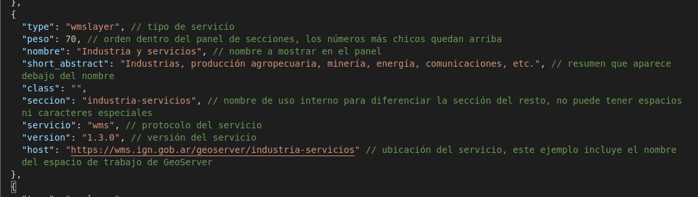

# Configuración

   > Esta sección explica cómo se pueden configurar las capas, los mapas base, el aspecto visual, extensiones y vista del mapa.

Los mapas base y capas se definen en el archivo `src/config/data.json`, la ubicación y zoom iniciales junto a otras opciones en `src/config/preferences.json`, ambos deben ser creados sino se carga la configuración por defecto en `src/config/default`.

## Mapas base y capas
---

El archivo `data.json` se compone de bloques llamados **items**, el primero agrupa los mapas base y los siguientes las secciones desplegables que agrupan capas.

Los mapas base se incluyen en un listado separado:

En el archivo data dentro de la configuración por defecto se agrega un ejemplo como el de la siguiente imagen.

En verde se agregan comentarios con la explicaicón de cada atributo.

### Capas desde WMS y WMTS

Dentro del archivo `data.json` se pueden agregar servicios WMS y WMTS.

En "items" se pueden definir servicios, cada uno dentro de un bloque (encerrado entre llaves "{}"). Cada bloque sirve para que la aplicación solicite el documento de capacidades al servicio WMS / WMTS, ese archivo contiene un listado de las capas que publica. Con esa información la aplicación genera de forma automática en el panel de capas o menú lateral una sección colapsable que contiene las capas de ese servicio como se ve en la siguiente imagen.

Ejemplo con comentarios:

## Parámetros de aplicación
---

En el archivo `preferences.json` se pueden definir opciones de inicio de la aplicación como extensiones a omitir, posición y zoom del mapa entre otros.

Ejemplo con comentarios:

## Apariencia
---

Para modificar el aspecto visual de la aplicación debe agregarse en  `src/config/styles` los siguientes directorios y archivos:

- `src/config/styles/css/main.css` : reglas de estilos CSS (el original está en `src/styles/css`)
- `src/config/styles/images` : logos y otras imágenes
- `src/config/styles/images/legends` : la aplicación busca por defecto en esta ubicación imágenes con el mismo nombre que las capas y las agrega al panel usándolas como leyenda o previsualización

- Se pueden encontrar [ejemplos][] para facilitar esta personalizacion

## Problemas posibles

Si la sintaxis de los archivos JSON es incorrecta, la aplicación podría detener su ejecución o quedar cargada parcialmente.

Si las secciones u orígenes de datos WMS / WMTS no tienen los atributos indicados en este artículo podrían quedar sin cargar en el panel, o con un orden o datos incorrectos.

[ejemplos]: src/docs/customization.md