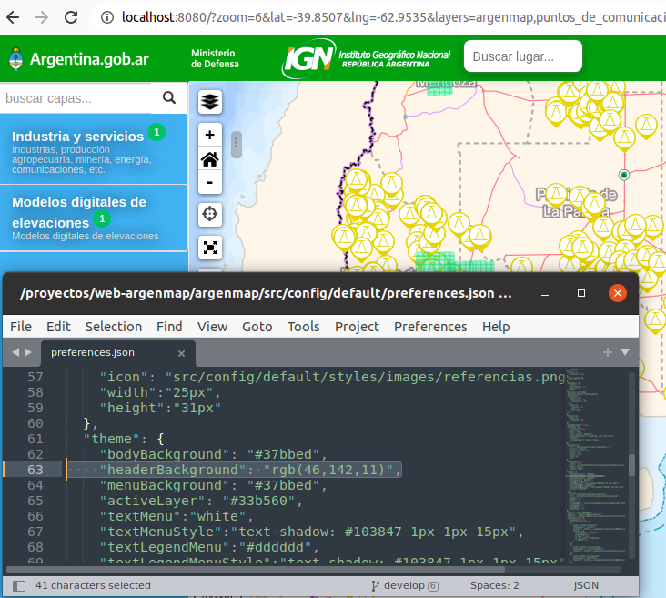
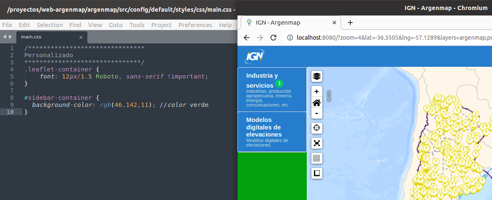

# Personalización de Apariencia

   > Esta sección explica cómo personalizar el aspecto visual editando el archivo preferences.json y que estos cambios no se pierdan si decide actualizar la versión de argenmap por una mas nueva.

Para modificar el aspecto visual de la aplicación lo mas recomendable es editar el archivo  `src/config/default/preferences.json` 

## Ejemplos

### Cambios en la barra superior

Para cambiar el color de la barra superior lo mejor es editar el archivo preferences.json

Editar el archivo src/config/default/preferences.json y colocar el color en la siguiente línea

```json
  "theme": {
    ...
    "headerBackground": "rgb(46,142,11)",
    ...
    },
```



### Cambios en las capas

#### Cambios en la barra de menú

Para cambiar el color del menu de capas lo mejor es editar el archivo preferences.json

Editar el archivo src/config/default/preferences.json y colocar el color en la siguiente línea

```json
  "theme": {
    ...
    "menuBackground": "#37bbed",
    ...
    },
```


#### Cambio de color a las capas activas

Para cambiar el color de las capas activas lo mejor es editar el archivo preferences.json

Editar el archivo src/config/default/preferences.json y colocar el color en la siguiente línea

```json
  "theme": {
    ...
    "activeLayer": "#33b560",
    ...
    },
```
