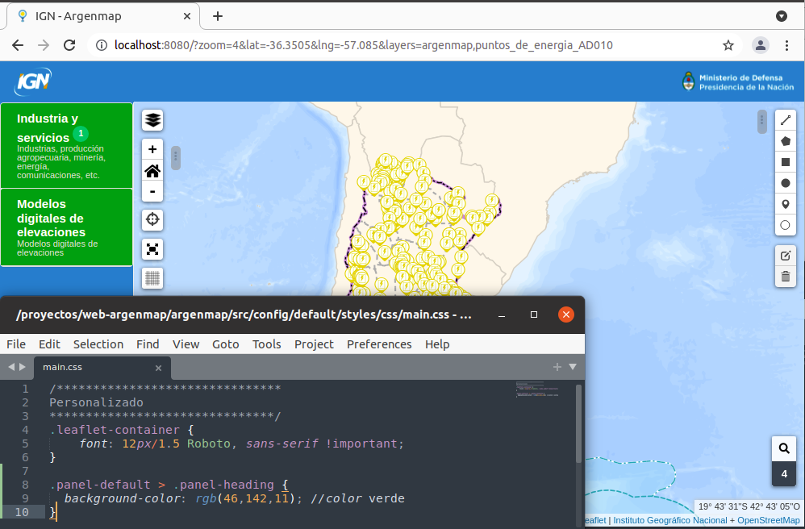

# Personalización de Apariencia

   > Esta sección explica cómo personalizar el aspecto visual editando el archivo main.css y que estos cambios no se pierdan si decide actualizar la versión de argenmap por una mas nueva.
   Algunos cambios simples se pueden realizar desde el archivo preferences.json y los mas complejos se realizan desde main.css

Para modificar el aspecto visual de la aplicación lo mas recomendable es editar el archivo  `src/config/styles/css/main.css` y los cambios de color mas comunes se recomienda realizarlos desde el archivo  `src/config/default/styles/preferences.json`

## Ejemplos

### Cambios en la barra superior

Para cambiar el color de la barra superior lo mejor es editar el archivo preferences.json

Editar el archivo src/config/default/styles/preferences.json y colocar el color en la siguiente línea

```json
  "theme": {
    ...
    "headerBackground": "#37bbed",
    "menuBackground": "#37bbed",
    "activeLayer": "#33b560",
    ...
    },
```


Se puede realizar cualquier tipo de cambio css, en este ejemplo se cambia el color

Agregar al archivo src/config/styles/css/main.css las siguientes líneas

```css
/*******************************
Barra superior
*******************************/
.navbar {
  background-color: rgb(46,142,11); //color verde}
```


### Cambios en la barra de menú

Para cambiar el color de la barra superior lo mejor es editar el archivo preferences.json

Editar el archivo src/config/default/styles/preferences.json y colocar el color en la siguiente línea

```json
  "theme": {
    ...
    "headerBackground": "#37bbed",
    "menuBackground": "#37bbed",
    "activeLayer": "#33b560",
    ...
    },
```


Se puede realizar cualquier tipo de cambio css, en este ejemplo se cambia el color

Agregar al archivo src/config/styles/css/main.css las siguientes líneas


```css
/*******************************
Barra de menú
*******************************/
#sidebar-container {
  background-color: rgb(46,142,11); //color verde
}
```


### Cambios en las capas

Se puede realizar cualquier tipo de cambio css, en este ejemplo se cambia el color

#### Cambio en el menú desplegable

Agregar al archivo src/config/styles/css/main.css las siguientes líneas


```css
/*******************************
Capas
*******************************/
.panel-default > .panel-heading {
  background-color: rgb(46,142,11); //color verde
}
```



#### Cambio de color a las capas activas

Para cambiar el color de las capas activas lo mejor es editar el archivo preferences.json

Editar el archivo src/config/default/styles/preferences.json y colocar el color en la siguiente línea

```json
  "theme": {
    ...
    "activeLayer": "#33b560",
    ...
    },
```


Agregar al archivo src/config/styles/css/main.css las siguientes líneas

```css
/*******************************
Capas
*******************************/
.panel-default > .panel-heading {
  background-color: rgb(46,142,11); //color verde
}
```

