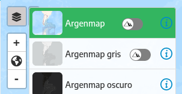

# Configuration

   > This section explains how layers, basemaps, visual appearance, extents, and map view can be configured.

The basemaps and layers are defined in the file `src/config/data.json`, the initial location and zoom along with other options in`src/config/preferences.json`, both must be created otherwise the configuration is loaded by default in `src/config/default`.

## Base maps and layers
---

The `data.json` file is made up of blocks called **items**, the first one groups the basemaps and the next the drop-down sections that group layers.

Basemaps are included in a separate listing:

In the data file within the default configuration is added an example like the one in the following image.

Green comments are added with the explanation of each attribute.

### Layers from WMS and WMTS

Inside the `data.json` file you can add WMS and WMTS services.

In "items" you can define services, each one within a block (enclosed in braces "{}"). Each block is used for the application to request the capabilities document from the WMS / WMTS service, this file contains a list of the layers it publishes. With this information, the application automatically generates a collapsible section in the layers panel or side menu that contains the layers of that service, as seen in the following image.

Example with comments:

## Application parameters
---

In the `preferences.json` file you can define application startup options such as extensions to exclude, map position and zoom, among others.

Example with comments:

## Appearance
---

To modify the visual appearance of the application, the following directories and files must be added in `src/config/styles`:

- `src/config/styles/css/main.css`: CSS style rules (original is in`src/styles/css`)
- `src/config/styles/images`: logos and other images
- `src/config/styles/images/legends`: the app searches by default in this location for images with the same name as the layers and adds them to layers buttons as a legend or preview

## Possible problems

If the syntax of JSON files is incorrect, the application could stop running or be partially loaded.

If the sections or WMS / WMTS data sources do not have the attributes indicated in this article, they could be left without loading in the panel, or with an incorrect order or data.