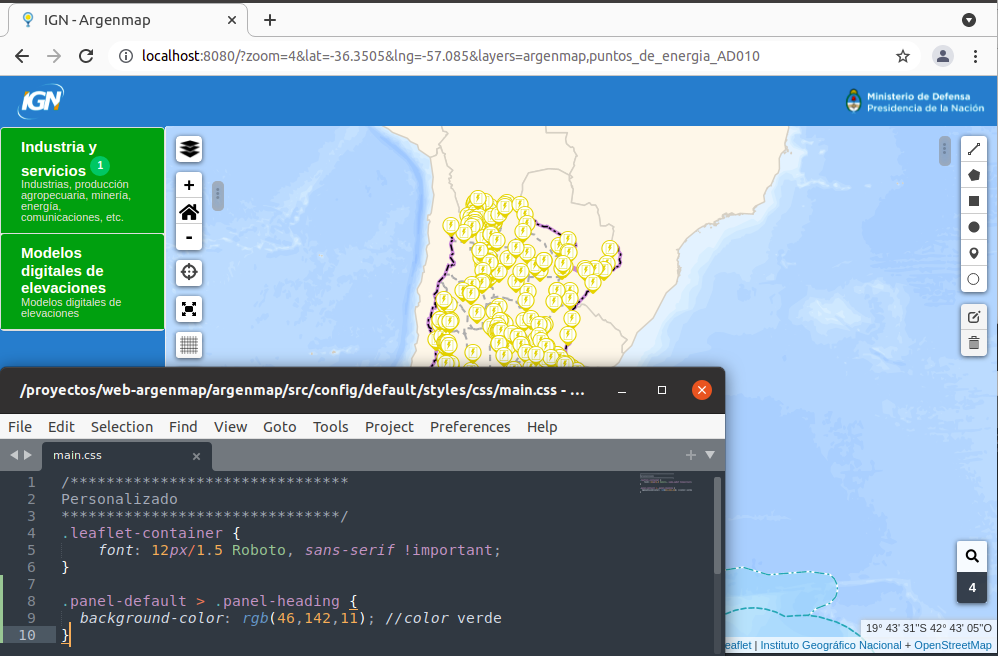
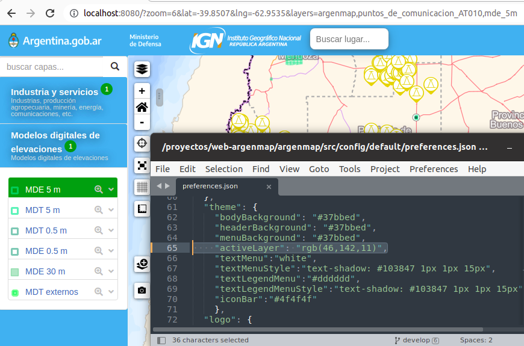

# Visual Appearance

   > This section explains how to customize visual appearance from main.css file in a way these changes persist through application updates.

Para modificar el aspecto visual de la aplicación lo mas recomendable es editar el archivo  `src/config/styles/css/main.css` 

## Examples

### Custom top bar style

You can change any css attribute, this example changes the color

Add these lines to src/config/styles/css/main.css 

```css
/*******************************
Barra superior
*******************************/
.navbar {
  background-color: rgb(46,142,11); //color verde}
```


### Custom Menu bar style

You can change any css attribute, this example changes the color

Add these lines to src/config/styles/css/main.css 


```css
/*******************************
Barra de menú
*******************************/
#sidebar-container {
  background-color: rgb(46,142,11); //color verde
}
```


### Custom layer style

You can change any css attribute, this example changes the color

#### Custom drop down menu style

You can change any css attribute, this example changes the color


```css
/*******************************
Capas
*******************************/
.panel-default > .panel-heading {
  background-color: rgb(46,142,11); //color verde
}
```



#### Custom active layer style

You can change any css attribute, this example changes the color

```css
/*******************************
Capas
*******************************/
.panel-default > .panel-heading {
  background-color: rgb(46,142,11); //color verde
}
```

